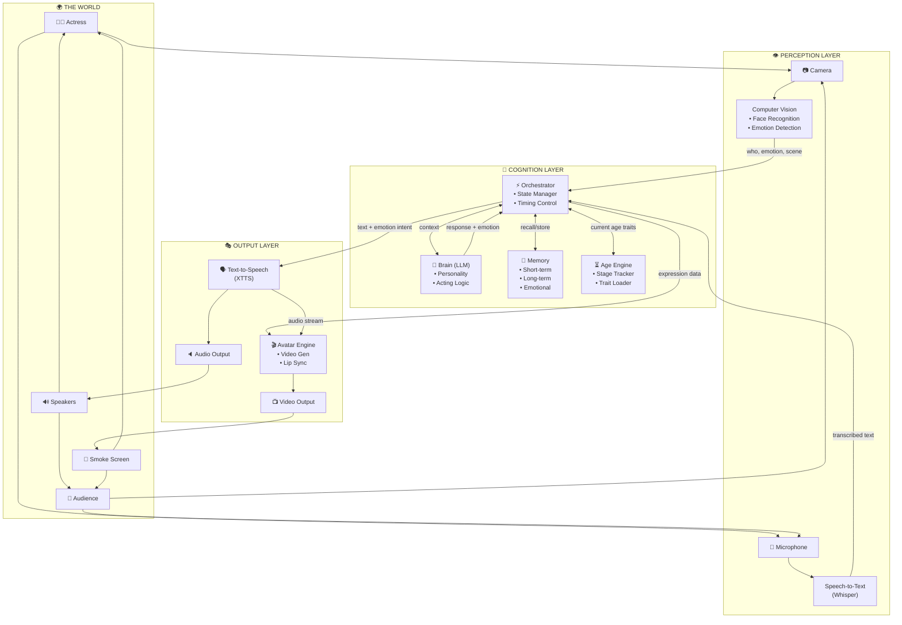
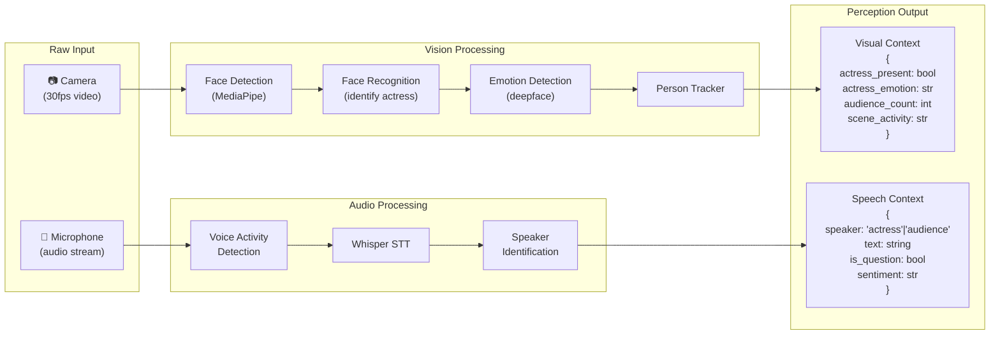
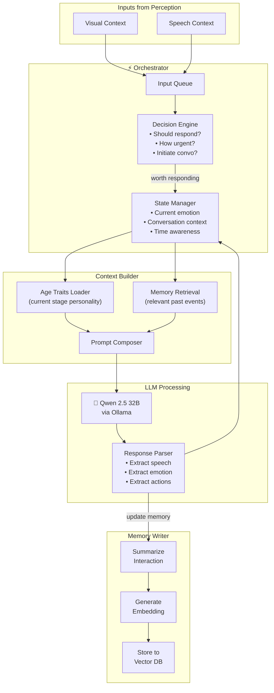
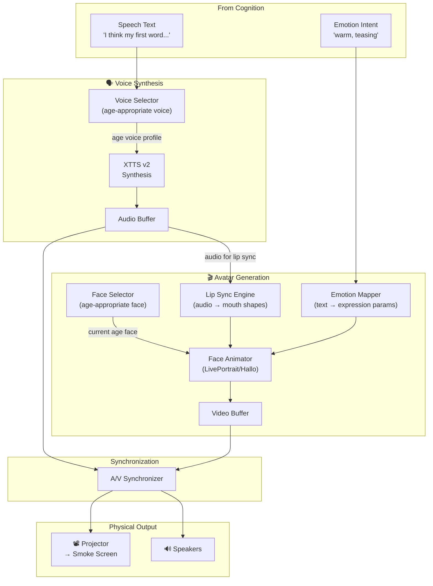
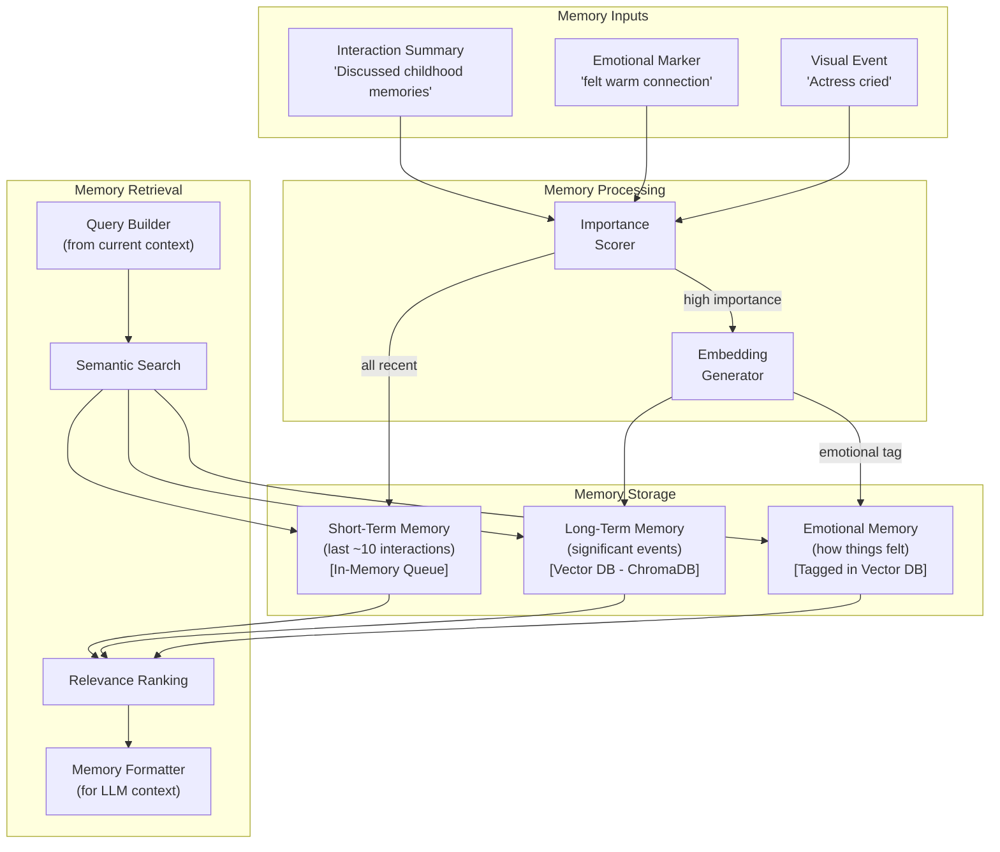
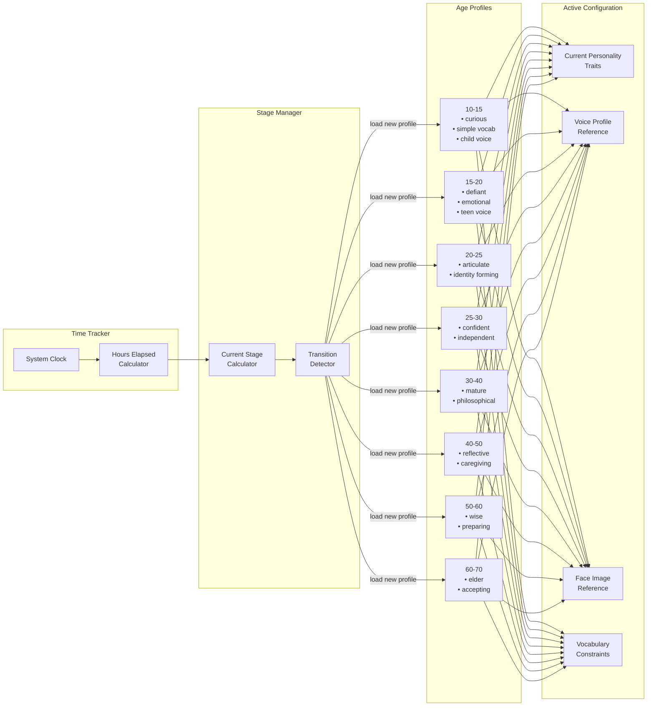
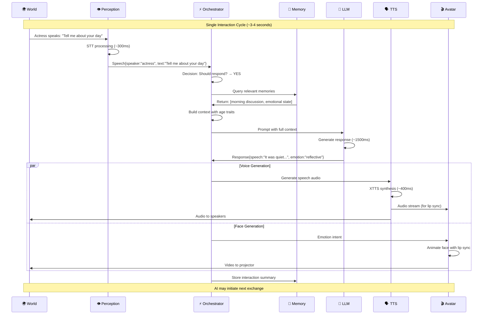
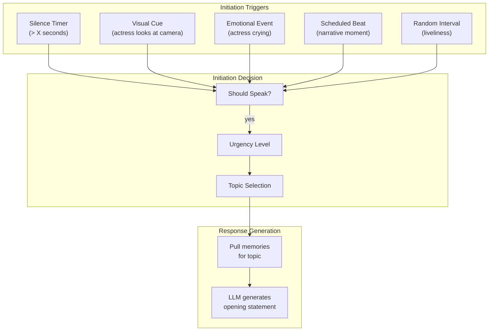
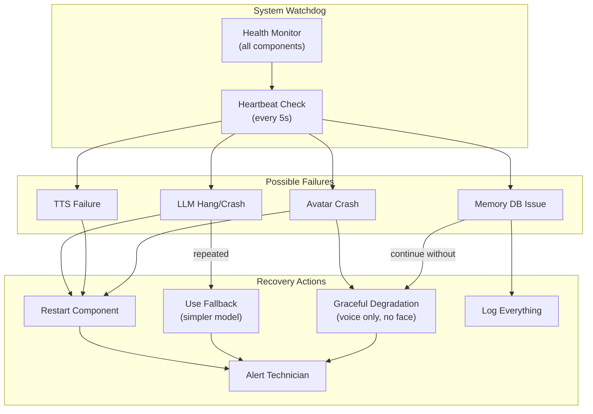

# AI Actor - System Architecture

> **Last Updated**: 2026-02-01  
> **Status**: Draft / Planning

---

## Overview

This document describes the system architecture for a 72-hour AI theatrical performance. The AI "being" perceives the world through cameras and microphones, processes input through an LLM brain, and expresses itself through synthesized voice and animated face.

---

## High-Level Data Flow



---

## Detailed Component Data Flows

### 1. Perception Pipeline



**Data Types Produced:**
| Output | Format | Update Rate |
|--------|--------|-------------|
| Visual Context | JSON object | ~10 Hz (every 100ms) |
| Speech Context | JSON object | On speech end |
| Is Speaking | Boolean | Real-time |

---

### 2. Cognition Pipeline



**LLM Input Structure:**
```json
{
  "system_prompt": "You are [NAME], aged [CURRENT_AGE]...",
  "personality_traits": ["curious", "slightly defiant", ...],
  "current_emotional_state": "contemplative",
  "recent_memories": ["Earlier today, mother talked about...", ...],
  "long_term_memories": ["I remember when I was younger...", ...],
  "current_context": {
    "speaker": "actress",
    "speech": "Do you remember your first word?",
    "actress_emotion": "nostalgic",
    "time_of_day": "evening",
    "hours_elapsed": 34.5,
    "current_age_stage": "30-40"
  }
}
```

**LLM Output Structure:**
```json
{
  "speech": "I think my first word was 'why'. You always said I never stopped asking questions.",
  "emotion": "warm, slightly teasing",
  "internal_thought": "She seems tired. Should I suggest she rest?",
  "action": null,
  "should_store_memory": true,
  "memory_summary": "Discussed first words with mother, she seemed nostalgic"
}
```

---

### 3. Output Pipeline



**Critical Timing Constraints:**
| Step | Target Latency | Notes |
|------|---------------|-------|
| TTS Generation | < 500ms for first chunk | Streaming preferred |
| Lip Sync Calculation | < 50ms | Must stay ahead of audio |
| Face Animation | < 100ms per frame | 10+ FPS minimum |
| A/V Sync | < 50ms drift | Noticeable if worse |

---

### 4. Memory System



**Memory Categories:**
| Type | Retention | Retrieval Method | Example |
|------|-----------|------------------|---------|
| Short-term | Last 10 exchanges | Always included | "You just asked about my day" |
| Long-term | Full 72 hours | Semantic search | "I remember when you told me about grandma" |
| Emotional | Full 72 hours | Tag + search | "The last time I felt this sad was..." |
| Milestone | Permanent | Direct access | "When I turned 30..." |

---

### 5. Age Progression System



---

## Complete Interaction Sequence



---

## Proactive Conversation Initiation



---

## Failure & Recovery



---

## Physical Setup Diagram

```
┌────────────────────────────────────────────────────────────────────────────┐
│                           PERFORMANCE SPACE                                 │
│                                                                            │
│    ┌──────────┐                                      ┌──────────────┐     │
│    │ CAMERA 1 │◄─────────────────────────────────────│   AUDIENCE   │     │
│    │ (wide)   │                                      │              │     │
│    └──────────┘                                      └──────────────┘     │
│                                                                            │
│                        ┌─────────────────────┐                            │
│                        │                     │                            │
│    ┌──────────┐        │    SMOKE SCREEN     │        ┌──────────┐       │
│    │ CAMERA 2 │◄───────│   (AI FACE PROJ)    │───────►│PROJECTOR │       │
│    │ (close)  │        │                     │        └──────────┘       │
│    └──────────┘        └─────────────────────┘                            │
│                                    ▲                                       │
│                                    │                                       │
│                              ┌─────┴─────┐                                │
│          ┌────────┐         │           │         ┌────────┐             │
│          │  MIC   │         │  ACTRESS  │         │SPEAKERS│             │
│          │(lapel) │◄────────│           │────────►│(stereo)│             │
│          └────────┘         │           │         └────────┘             │
│                             └───────────┘                                 │
│                                                                            │
│                                                                            │
│    ┌───────────────────────────────────────────────────────────────┐     │
│    │                    TECH BOOTH (hidden)                         │     │
│    │  ┌──────────┐  ┌──────────┐  ┌──────────┐  ┌──────────┐      │     │
│    │  │ MAIN PC  │  │ BACKUP   │  │ AUDIO    │  │ MONITOR  │      │     │
│    │  │(M4 Pro?) │  │ SYSTEM   │  │ MIXER    │  │ STATION  │      │     │
│    │  └──────────┘  └──────────┘  └──────────┘  └──────────┘      │     │
│    └───────────────────────────────────────────────────────────────┘     │
└────────────────────────────────────────────────────────────────────────────┘
```

---

## Your Whiteboard vs My Proposal


**Key additions in my proposal:**

| Your Diagram | My Addition | Why |
|--------------|-------------|-----|
| Brain LLM | + Orchestrator layer | Separates coordination logic from LLM, handles timing, state |
| Integration Layer | Detailed perception processing | Face recognition, emotion detection, speaker ID needed |
| "LEARN?" | Full memory system | Short-term, long-term, emotional memory with vector DB |
| Video Gen | + Sync mechanism | Need explicit A/V synchronization for lip-sync |
| — | Age Engine | Manages personality/voice/face transitions |
| — | Proactive triggers | System for AI-initiated conversation |
| — | Failure recovery | Critical for 72-hour reliability |

---

## Next Steps

1. [ ] Review this architecture - does it match your vision?
2. [ ] Discuss the Orchestrator design in more detail
3. [ ] Prototype the core conversation loop
4. [ ] Test individual components (Whisper, LLM, TTS)

---

*This architecture is a living document and will evolve as we prototype and learn.*
