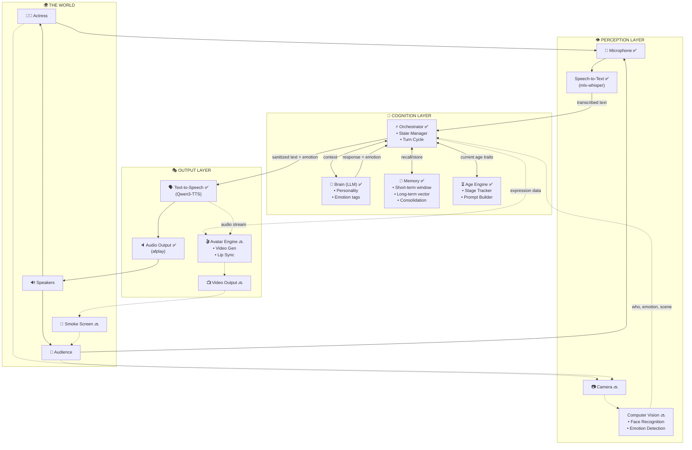
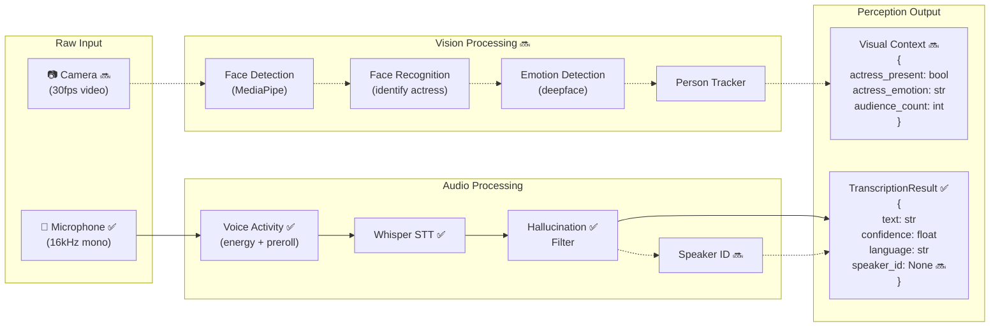
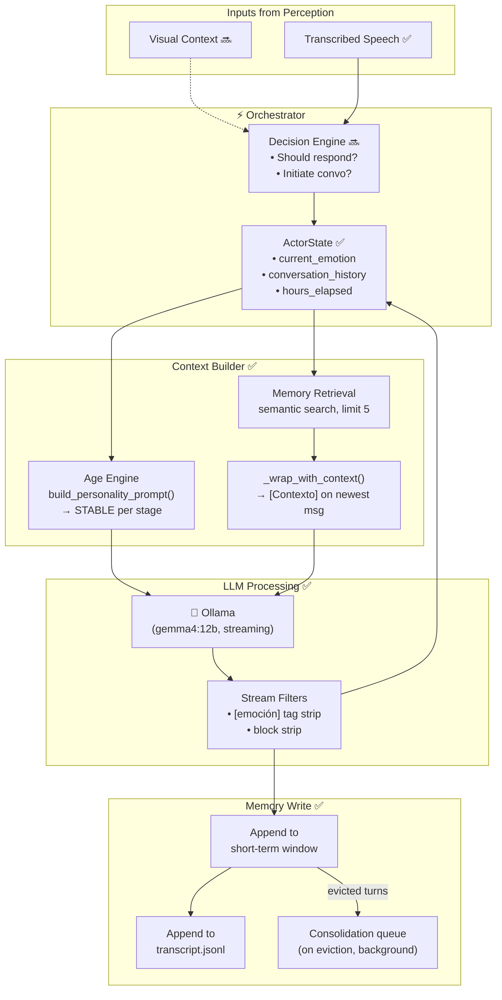
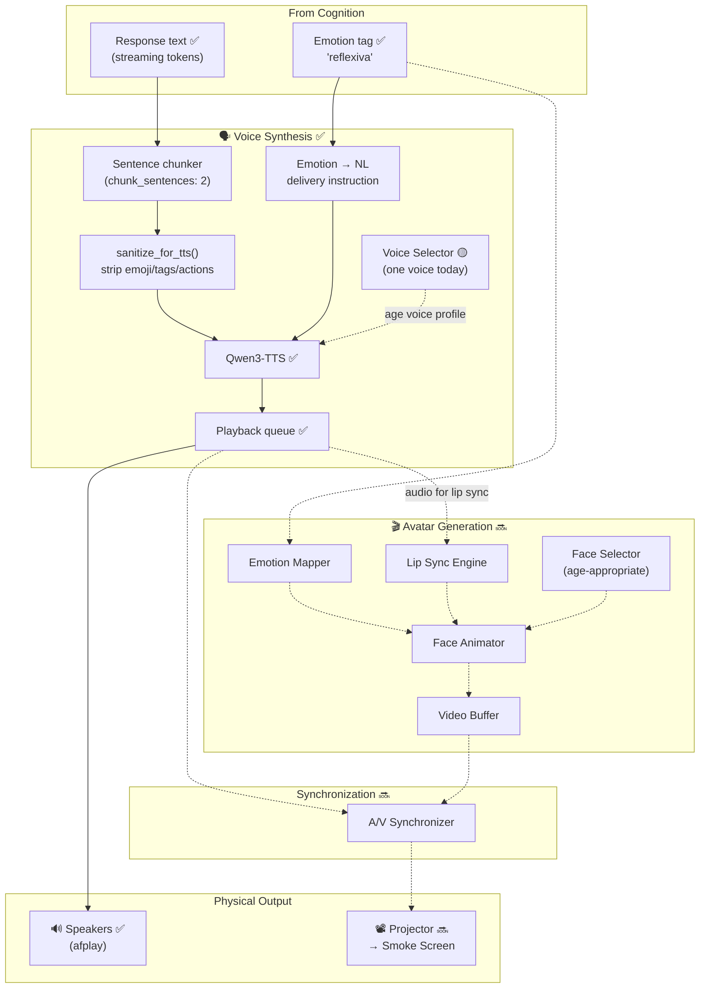
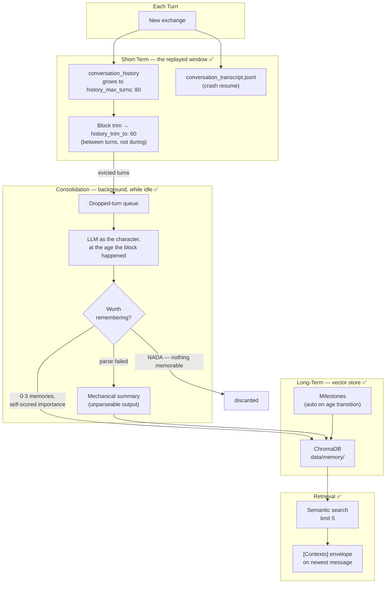
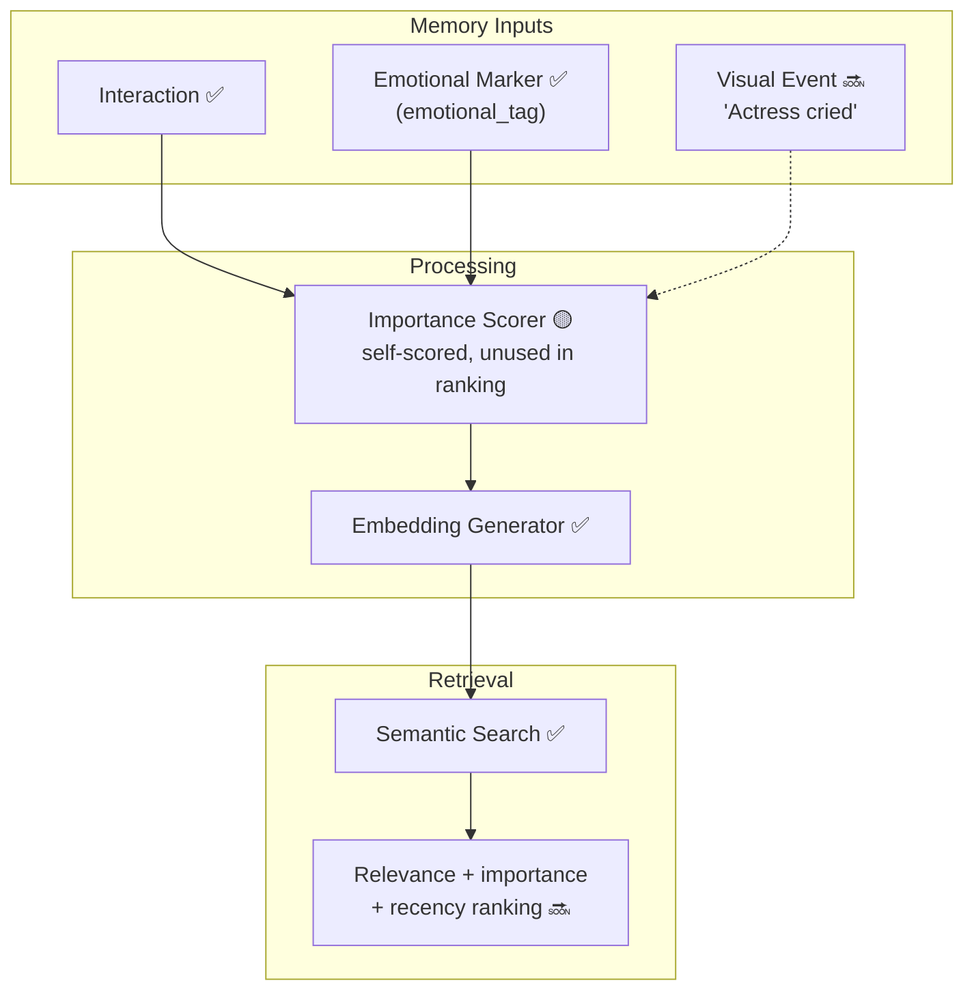
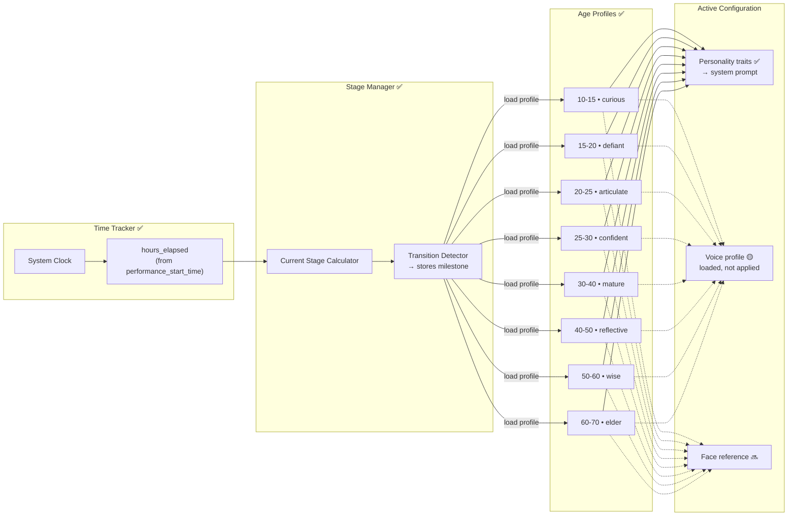
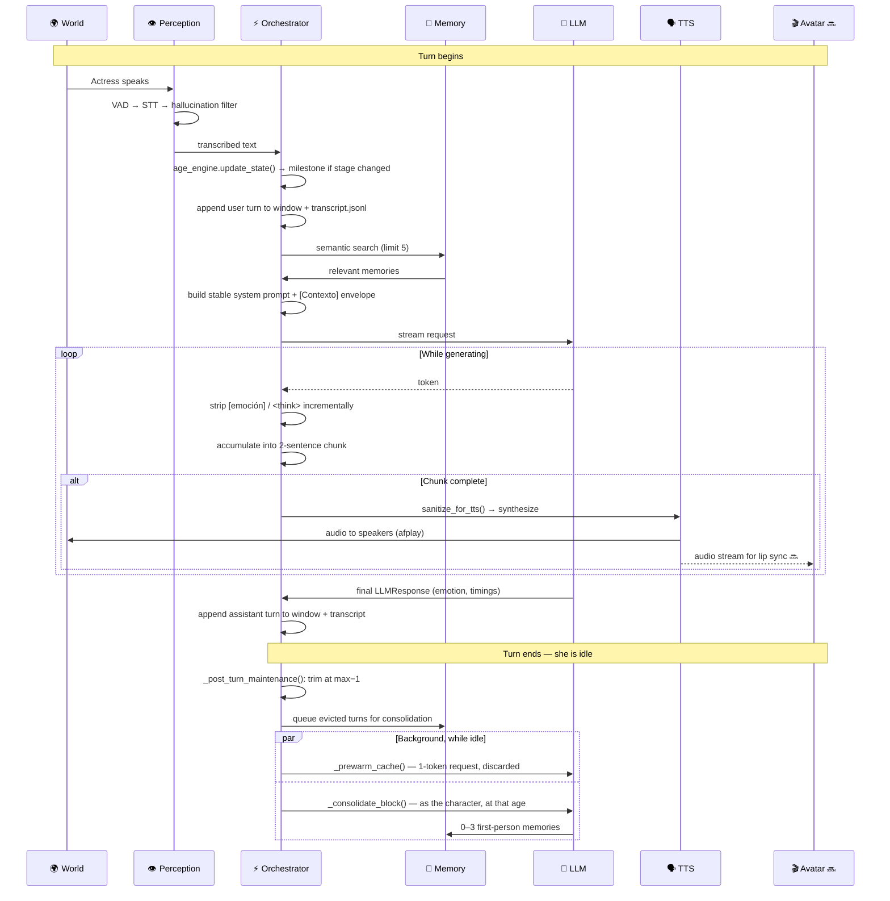
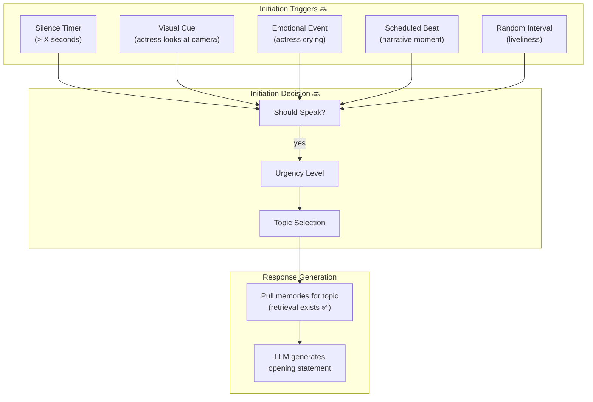
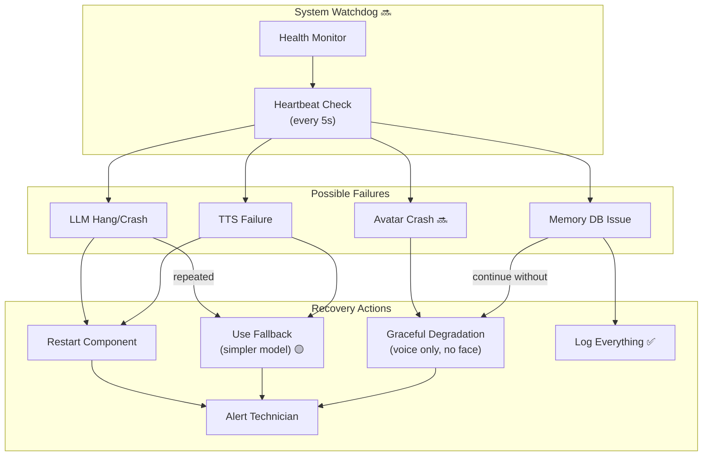

# Indira — System Architecture

> **Last updated**: 2026-08-19
> **Status**: Living document — it holds both the **target design** and the **current implementation**, deliberately.
>
> **Read this first.** The target design describes the full installation as originally conceived. A significant part of it is **not built yet**, and that is expected at this stage. Every section is tagged:
>
> - ✅ **Implemented** — exists and works in `src/`
> - 🟡 **Partial** — code exists but is incomplete or not wired in
> - 🔜 **Planned** — designed here, not yet in code
>
> Where a built subsystem diverged from the original design, both are shown: what runs today, and what the design still aims at. See [TECH_STACK.md](TECH_STACK.md) for the technology choices behind each component.

---

## Overview

A 72-hour AI theatrical performance. An artificial being ages from 10 to 70 in real time, conversing with a live actress. The target system perceives through cameras and microphones, thinks through a local LLM, and expresses itself through synthesized voice and a projected animated face.

**What runs today** is the audio spine of that system: microphone → speech-to-text → orchestrator → LLM → text-to-speech → speakers, with aging personality, two-tier memory, and emotional expression. Everything is local; no cloud calls at runtime.

---

## Implementation Status

| Layer | Component | Status |
|-------|-----------|--------|
| Perception | Microphone capture + energy VAD | ✅ Implemented |
| Perception | STT (mlx-whisper) + anti-hallucination filtering | ✅ Implemented |
| Perception | Speaker identification | 🔜 Planned — field exists, nothing populates it |
| Perception | Camera / face detection / recognition | 🔜 Planned |
| Perception | Visual emotion detection | 🔜 Planned |
| Cognition | Orchestrator conversation loop | ✅ Implemented |
| Cognition | LLM brain (Ollama, streaming, emotion tags) | ✅ Implemented |
| Cognition | Age engine (8 stages, prompt building, `/age` travel) | ✅ Implemented |
| Cognition | Long-term memory (Chroma semantic / simple keyword) | ✅ Implemented |
| Cognition | Short-term window + block trimming | ✅ Implemented |
| Cognition | Memory consolidation (in-character compression) | ✅ Implemented |
| Cognition | Prompt-cache optimization (stable prefix, idle prewarm) | ✅ Implemented |
| Cognition | Importance-weighted retrieval | 🟡 Consolidation self-scores; retrieval ignores it |
| Cognition | Decision engine / proactive initiation | 🔜 Planned — no code, no config |
| Output | TTS → speaker (Qwen3-TTS, macOS `say` fallback) | ✅ Implemented |
| Output | TTS input sanitization | ✅ Implemented |
| Output | Overlapping streaming TTS pipeline | ✅ Implemented |
| Output | Age-based voice change | 🟡 Designed, not applied — one voice today |
| Output | Avatar / face animation / lip-sync | 🔜 Planned |
| Output | Video output / projection / smoke screen | 🔜 Planned |
| Reliability | Transcript + performance-state persistence | ✅ Implemented |
| Reliability | Crash resume inside the 72h window | ✅ Implemented |
| Reliability | A/V sync | 🔜 Planned |
| Reliability | Watchdog / failure recovery | 🔜 Planned |
| Reliability | 72-hour endurance validation | 🔜 Planned |

---

## High-Level Data Flow

> 🟡 **Partial.** The audio path (mic → STT → orchestrator → LLM → TTS → speakers) is ✅ implemented. Camera/CV inputs and avatar/projector outputs are 🔜 planned. This is the **target** diagram; dashed elements below are not built.



---

## Detailed Component Data Flows

### 1. Perception Pipeline

> 🟡 **Partial.** Audio path ✅ — mic capture, energy-based VAD with pre-roll, mlx-whisper STT, and anti-hallucination filtering (`orchestrator.run_voice_mode`, around lines 986–1034). Vision path 🔜 not built. **Speaker identification is not implemented** — `TranscriptionResult.speaker_id` and `ConversationTurn.speaker_id` exist and are plumbed through persistence, but nothing populates them.



**Anti-hallucination filtering** is worth noting because it is not in the original design. Whisper emits characteristic phantom phrases on silence or noise ("thank you for watching", subtitle credits). These are filtered before reaching the orchestrator — without it, room noise generates conversational turns and the character responds to nobody.

**Audio parameters** (`config/default.yaml`): 16 kHz mono, `energy_threshold 0.03`, `silence_duration_ms 800`, `preroll_ms 300`. Language pinned to `es`.

---

### 2. Cognition Pipeline

> ✅ **Mostly implemented.** Orchestrator, context building, LLM call, response parsing, and memory write all exist. The **Decision Engine** ("should respond? / initiate?") is 🔜 not built — every input currently gets a response.



#### What actually reaches the LLM

> ⚠️ **Corrected.** Earlier versions of this document showed a structured JSON request and a structured JSON response. **Neither exists.** The real protocol is a standard chat completion with a plain-text response, and the structure below is load-bearing for the prompt-cache contract (§6).

**Request** — three parts, each with a different volatility:

```
system_prompt:  built by age_engine.build_personality_prompt()
                permanent identity (from config) + age-stage traits (from profiles/)
                ── BYTE-STABLE for the whole age stage; no per-turn content ──

messages:       [ {role: "user",      content: "..."},
                  {role: "assistant", content: "[emoción] ..."},   ← tags re-prefixed on replay
                  ...                                                by get_recent_messages()
                  {role: "user",      content: "[Contexto — no es parte del diálogo:
                                                 <retrieved memories>]

                                                 <what she actually said>"} ]
                                                 ↑ volatile content rides ONLY here
```

**Response** — plain text, with a leading emotion tag:

```
[reflexiva] Me acuerdo, sí. Era invierno y vos no querías salir.
```

The `[emoción]` prefix is parsed off by `ollama_provider._parse_emotion` (authoritative, end of stream) and by `EmotionTagFilter` (incremental, feeds display and TTS). The tag becomes `state.current_emotion`, which drives the TTS delivery instruction and the console. There is no `internal_thought`, no `action`, no `should_store_memory` — the model returns speech and an emotion, nothing else.

---

### 3. Output Pipeline

> 🟡 **Partial.** TTS path ✅ — sanitization, Qwen3-TTS synthesis, `afplay` playback, with an overlapping streaming pipeline. Age-based voice selection 🟡 designed but not applied. Avatar generation, lip-sync, A/V sync, and projection 🔜 not built.



**TTS input sanitization ✅** is a hard contract, not a nicety. Emojis, inline `[tags]`, and `*actions*` derail Qwen3-TTS into wrong-language output — Spanish text containing an emoji has produced CJK speech, verified by closed-loop probing. **All** text reaching any TTS provider passes through `text_filters.sanitize_for_tts()` first, and synthesis is skipped when it returns `""`. The console still shows the original text, so the operator sees what she "wrote" while the speaker hears only what is speakable.

**Critical timing constraints** (targets; only the first is currently measurable):

| Step | Target | Status |
|------|--------|--------|
| TTS first chunk | < 500 ms | ✅ Met — overlapping pipeline hides most of it |
| Lip sync calculation | < 50 ms | 🔜 Not built |
| Face animation | < 100 ms/frame, 10+ FPS | 🔜 Not built |
| A/V sync drift | < 50 ms | 🔜 Not built |

---

### 4. Memory System

> ✅ **Implemented, and substantially redesigned since the original plan.** Both versions are below: what runs today, and what the design still aims at.

#### 4a. As built ✅

Two tiers that differ **in kind**, not just in retention. This is the key departure from the original design.



**Short-term is replayed verbatim, never searched.** The window holds the recent transcript and is re-sent in full on every turn. It grows to 80 turns, then trims **in one block** back to 60 — not one turn at a time. A sliding window would change the prompt prefix every turn and destroy KV-cache reuse (§6).

**Long-term is searched, never replayed wholesale.** Only semantic search reaches it, with the top 5 results riding in the `[Contexto]` envelope.

**Consolidation is the interesting part.** When turns fall out of the window they are neither discarded nor stored verbatim. A background worker feeds the block back to the LLM **as the character, at the age the block happened**, in Spanish, asking her what she remembers of it:

- She returns **0–3 first-person memories**, each with a self-scored importance (0.7–1.0 for revelations, strong emotions, promises, fights; 0.4–0.6 for a significant conversation; below that is not remembered).
- Blocks with nothing worth keeping return `NADA` and store nothing.
- Unparseable output falls back to a mechanical summary rather than losing the block.
- Runs while she is idle, so it never delays a turn.

The result is that long-term memory holds *her recollections*, not a transcript — better retrieval material, and dramaturgically correct: she remembers being ten the way a ten-year-old would.

> **Operational requirement:** run Ollama with `OLLAMA_NUM_PARALLEL=2` (`scripts/start_ollama.sh`), or the consolidation call evicts the conversation's KV-cache slot.

**Memory record** (`memory_type`: `interaction` | `observation` | `milestone` | `emotional` | `consolidated`):

| Field | Purpose |
|-------|---------|
| `content` | First-person recollection |
| `age_stage` | The age she was when it happened |
| `emotional_tag` | How it felt |
| `importance` | Self-scored 0.0–1.0 (fixed `0.5` on non-consolidated paths) |
| `memory_type` | Category |

#### 4b. Target design 🔜

The original design remains the direction of travel for the parts not yet built:



**Still to build:** visual events as a memory source (blocked on vision), and retrieval that weights importance and recency rather than ranking on semantic similarity alone. Consolidation already produces good importance scores; nothing consumes them yet.

---

### 5. Age Progression System

> ✅ **Implemented.** Time-based 8-stage progression, per-stage personality from `profiles/`, system-prompt building, milestone storage on transition, and `/age` time travel. Voice-profile switching 🟡 (paths loaded, not applied by TTS); face-profile switching 🔜 (no avatar yet).



Stages run 9 hours each across the 72-hour performance. `hours_elapsed` derives from `performance_start_time`, so `/age N` time-travels by rewriting that timestamp — rehearsing any age costs nothing and uses the same code path as the real run.

**Note:** an age transition rebuilds the system prompt, which invalidates the KV cache. This is the one unavoidable prefill spike, and it happens 8 times per performance. Accepted.

---

## 6. The Prompt-Cache Contract ✅

> Not in the original design, and now one of the load-bearing constraints of the system. Anything that violates it costs seconds of latency on a live turn.

Ollama reuses its KV cache only for a **byte-identical prompt prefix**. Everything below follows from that single fact:

| Rule | Why |
|------|-----|
| System prompt is byte-stable within an age stage | Any per-turn content in it invalidates the entire cache every turn |
| Volatile content rides on the **newest message only** | Those tokens are new regardless, so nothing behind them is invalidated |
| History stores clean text | Replay stays prefix-stable across turns |
| Emotion is **output-only** | Injecting it back into the prompt would make the prefix turn-dependent |
| Window trims **in blocks, between turns** | A per-turn slide changes the prefix constantly |

**Emotional continuity without prompt injection:** `state.get_recent_messages()` re-prefixes the stored `[emoción]` tags onto replayed assistant turns. She sees her own past emotional states in the transcript, which is what maintains continuity — the tags are never added to the system prompt.

---

## 7. The Turn Cycle ✅

> ⚠️ **Corrected.** The original sequence showed generation completing before speech began. The real pipeline **overlaps** them, and does bookkeeping between turns rather than inside them.



**Three things happen between turns, not during them** — all so the cost lands in the silence rather than in her response time:

1. **Trim at `max−1`.** The window is trimmed one exchange *early*, because trimming on the next live turn would change the prefix mid-conversation and force a full re-prefill.
2. **Cache prewarm.** A background 1-token request re-prefills the new prefix. It waits for `state.is_speaking` to clear first, and its output is discarded.
3. **Consolidation.** Evicted turns are compressed into long-term memories.

---

## 8. Persistence & Resume ✅

> Not in the original design. For a 72-hour durational piece, this is the difference between a crash being a 30-second interruption and being the end of the show.

| File | Contents | On restart |
|------|----------|------------|
| `data/performance_state.json` | `performance_start_time`, phase | Resumes at the correct age if still inside 72h |
| `data/conversation_transcript.jsonl` | Every turn: role, content, emotion, timestamp, speaker_id | Rebuilds the short-term window |
| `data/memory/` | ChromaDB vector store | Persistent by nature |

`--fresh` ignores saved state and starts at hour 0.

---

## 9. Proactive Conversation Initiation

> 🔜 **Planned. Nothing exists.** There is no `proactive:` config block and no initiation code anywhere in `src/`. She responds only when spoken to. (An earlier version of this document described a config block and task stub — that was inaccurate.)

**Attachment point:** a decision step ahead of `process_input_streaming`, driven by `state.last_interaction_time` and the memory store. Both already exist.



---

## 10. Failure & Recovery

> 🔜 **Planned.** No watchdog, heartbeat, or automatic recovery exists. Persistence (§8) means a manual restart is cheap, but nothing currently *notices* a hang or a wedged Ollama. Critical before any unattended 72-hour run.
>
> **Partial mitigation that does exist:** the `system` TTS provider (macOS `say`) is config-selectable, so a failed Qwen3-TTS load can be dropped to it — degraded voice rather than silence. It has no model to load and no dependency to install, so it cannot fail the same way. Nothing switches automatically.



**Known issue:** `main()` ends with `os._exit(0)` to force-kill the blocking `input()` executor thread — a normal return will not shut the process down. This produces a benign leaked-semaphore warning at exit. Acceptable in development, worth resolving before an unattended run.

---

## 11. Code Map

Where each concept in this document lives:

| Concept | Location |
|---------|----------|
| Turn cycle | `orchestrator.process_input_streaming` |
| Streaming + TTS overlap | `orchestrator._stream_and_speak`, `_tts_consumer` |
| Context envelope | `orchestrator._wrap_with_context` |
| Memory retrieval | `orchestrator._build_memory_context` |
| Consolidation | `orchestrator._consolidation_worker`, `_consolidate_block` |
| Between-turn maintenance | `orchestrator._post_turn_maintenance`, `_prewarm_cache` |
| Persistence | `orchestrator._append_transcript`, `_load_transcript`, `_persist_performance_state` |
| Voice mode + VAD + filtering | `orchestrator.run_voice_mode` |
| Slash commands | `orchestrator._handle_command` — `/help` `/status` `/memory` `/age N` `/lobotomy` `/quit` |
| System prompt building | `age_engine.build_personality_prompt` |
| State, window, trimming | `state.ActorState`, `get_recent_messages`, `trim_history` |
| Emotion parsing | `ollama_provider._parse_emotion`, `text_filters.EmotionTagFilter` |
| TTS sanitization | `text_filters.sanitize_for_tts` |
| Provider selection | `registry.py` |

---

## Physical Setup Diagram

> 🔜 **Planned.** Venue layout for the full installation. Only the microphone, speakers, and main machine are in use today.

```
┌────────────────────────────────────────────────────────────────────────────┐
│                           PERFORMANCE SPACE                                 │
│                                                                            │
│    ┌──────────┐                                      ┌──────────────┐     │
│    │ CAMERA 1 │◄─────────────────────────────────────│   AUDIENCE   │     │
│    │ (wide)🔜 │                                      │              │     │
│    └──────────┘                                      └──────────────┘     │
│                                                                            │
│                        ┌─────────────────────┐                            │
│                        │                     │                            │
│    ┌──────────┐        │    SMOKE SCREEN     │        ┌──────────┐       │
│    │ CAMERA 2 │◄───────│  (AI FACE PROJ) 🔜  │───────►│PROJECTOR │       │
│    │ (close)🔜│        │                     │        │    🔜    │       │
│    └──────────┘        └─────────────────────┘        └──────────┘       │
│                                    ▲                                       │
│                                    │                                       │
│                              ┌─────┴─────┐                                │
│          ┌────────┐         │           │         ┌────────┐             │
│          │  MIC ✅│         │  ACTRESS  │         │SPEAKERS│             │
│          │(lapel) │◄────────│           │────────►│(stereo)│             │
│          └────────┘         │           │         └───✅───┘             │
│                             └───────────┘                                 │
│                                                                            │
│    ┌───────────────────────────────────────────────────────────────┐     │
│    │                    TECH BOOTH (hidden)                         │     │
│    │  ┌──────────┐  ┌──────────┐  ┌──────────┐  ┌──────────┐      │     │
│    │  │ MAIN PC ✅│  │ BACKUP 🔜│  │ AUDIO 🔜 │  │ MONITOR🔜│      │     │
│    │  │(M4 Pro)  │  │ SYSTEM   │  │ MIXER    │  │ STATION  │      │     │
│    │  └──────────┘  └──────────┘  └──────────┘  └──────────┘      │     │
│    └───────────────────────────────────────────────────────────────┘     │
└────────────────────────────────────────────────────────────────────────────┘
```
